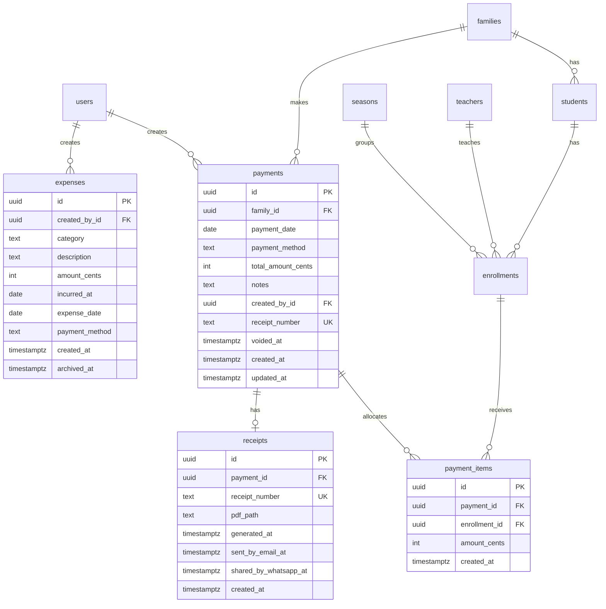

# Database Architecture Review

This document reflects the MVP payment-first schema. The MVP intentionally does not include invoices: families make payments, payments are allocated to enrollment rows through payment items, and receipts are generated from payments.

## Current ERD

## MVP Billing Flow

The supported MVP flow is:

`Family -> Payment -> PaymentItem -> Enrollment -> Receipt`

A `Payment` belongs directly to a `Family` and records the payment date, method, total amount, receipt number, void timestamp, audit creator, notes, and timestamps. A `PaymentItem` allocates part of the family payment to a specific `Enrollment`, allowing one family payment to cover multiple students or multiple enrollment charges. A `Receipt` belongs to one payment and stores the generated PDF storage path in `pdf_path`.

## Invoice Decision

No `Invoice` model remains in the MVP schema. Invoices were removed because the current product scope only requires direct family payments allocated to enrollments and receipt generation. Adding invoices without invoice line items would duplicate enrollment balances and create stale balance risk. If future requirements need formal statements, aging, taxes, or invoice numbers, invoices should be reintroduced together with invoice line items and allocation rules rather than as a standalone total/balance table.

## Table Notes

### `families`
Household aggregate for students and payments. Families own many students and can make many payments.

### `enrollments`
Season-aware enrollment record with fee, discount, final fee, paid, and remaining amounts. Payment history is available through related `payment_items`.

### `payments`
Family-level cash receipt. `total_amount_cents` is the payment total, `payment_method` stores the tender type, `payment_date` drives cash receipt reports, `receipt_number` provides the business-facing receipt identifier, and `voided_at` preserves history without deleting financial records.

### `payment_items`
Allocation table between payments and enrollments. This supports one payment covering multiple enrollments and multiple payments against the same enrollment.

### `receipts`
Generated receipt metadata for a payment. Receipt files are referenced by `pdf_path` so storage implementation details are not exposed as public URLs.

### `expenses`
Expense ledger with category, description, amount, `expense_date`, `payment_method`, and `archived_at`. The legacy `incurred_at` column is retained for compatibility, but new reporting should prefer `expense_date`.

## Reporting Indexes

- `payments(family_id)` for family payment history.
- `payments(payment_date)` and `payments(payment_date, voided_at)` for cash receipt reports.
- `payment_items(payment_id)` and `payment_items(enrollment_id)` for allocation lookups.
- `enrollments(status)` and `enrollments(status, archived_at)` for receivables and roster reports.
- `expenses(expense_date)` and `expenses(expense_date, archived_at)` for expense reporting.
