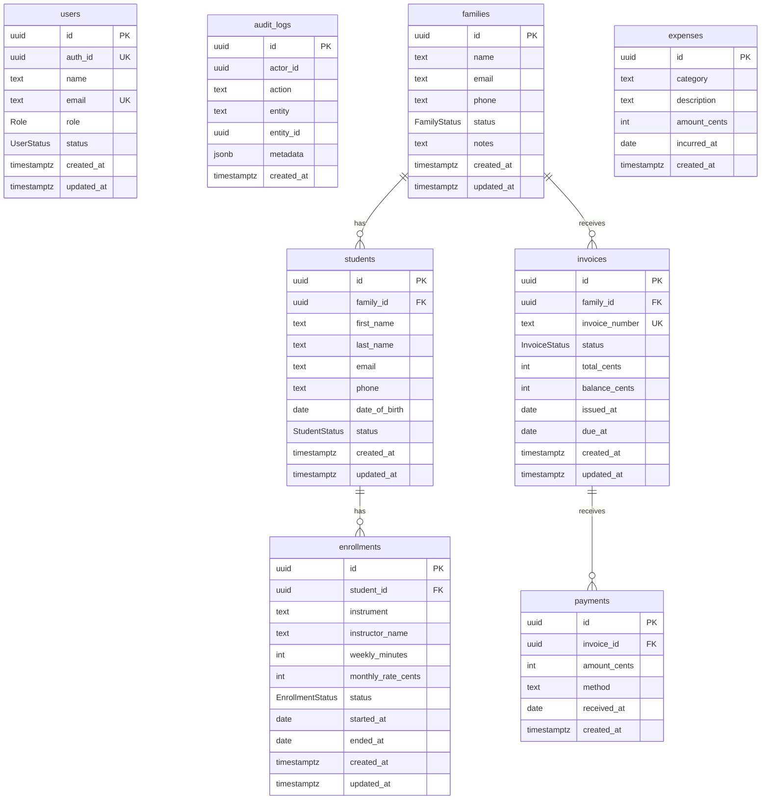

# Database Architecture Review

This document records the pre-Phase 3 review of the current Prisma and Supabase/Postgres database architecture. Phase 3 feature work should not begin until the open gaps in this review are approved and scheduled.

## Current ERD

## Table Review

### `users`
Application profiles mapped to Supabase auth users through `auth_id`. The table stores role, status, and contact identity for authorization and operations.

Relationships: no database-level foreign key currently connects `audit_logs.actor_id` to `users.id` or `users.auth_id`, so audit actor integrity is application-managed.

### `audit_logs`
Append-style operational log with generic `entity` and `entity_id` references. This supports historical event tracking, but because the entity relationship is polymorphic there is no database-enforced referential integrity.

### `families`
Billing and household aggregate. A family can own many `students` and many `invoices`. `status = INACTIVE` is the current soft-delete-like mechanism; no `deleted_at` column exists.

### `students`
Student profile linked to exactly one family. `onDelete: Restrict` from students to families prevents deleting a family that still has students. `status = INACTIVE` is the current soft-delete-like mechanism.

### `enrollments`
Instruction enrollment linked to one student. This table currently stores `instrument`, teacher name text, monthly rate, duration, status, and start/end dates. There is no `Season` or `Teacher` table, and there is no foreign key to a teacher or term.

### `invoices`
Family-level billing document. Invoices belong to one family and can receive many payments. Current fields support invoice totals and balances, but the schema has no invoice line items or allocation table that links charges/payments to specific students or enrollments.

### `payments`
Payment receipt linked to one invoice. Multiple payments per invoice are supported. Partial payment state is represented by invoice `balance_cents` and `status`, but the database does not enforce that `balance_cents = total_cents - sum(payments.amount_cents)`.

### `expenses`
Simple expense ledger with category, description, amount, and incurred date. This supports basic expense reporting, but has no vendor, attachment, approval, or soft-delete fields.

## Workflow Verification

| Workflow | Current support | Review notes |
| --- | --- | --- |
| One family can have multiple students. | Supported | `students.family_id` is a many-to-one foreign key to `families.id`. |
| One student can enroll in multiple seasons. | Partially supported | A student can have many enrollments, but there is no `seasons` table or `season_id`; seasons must be inferred from enrollment dates. |
| One family payment can cover multiple students. | Partially supported | A payment can pay one family invoice; if that invoice represents several students, the payment covers them indirectly. There is no invoice line or payment allocation table to prove the student-level split. |
| Partial payments are supported. | Supported with application discipline | Multiple payments and invoice balances/statuses exist. Database constraints do not enforce totals or prevent overpayment. |
| Multiple payments against the same enrollment are supported. | Not directly supported | Multiple payments can target one invoice, but payments do not target enrollments. An enrollment-level payment history requires invoice lines and payment allocations. |
| Historical data is preserved. | Partially supported | Created/updated timestamps and dated enrollments exist. Cascade deletes from students to enrollments and invoices to payments can destroy history if hard deletes are used. |
| Teacher reassignment does not break historical records. | Partially supported | `enrollments.instructor_name` snapshots a name string, which preserves text but cannot link to a teacher record or model reassignments. A teacher table plus assignment history is recommended. |
| Soft deletes do not affect financial reporting. | Partially supported | Families/students use status fields; invoices/payments/expenses do not have soft-delete fields. Hard-deleting invoices cascades to payments, which can break reporting. |

## Index and Query Performance Review

Existing useful indexes:

- `audit_logs(entity, entity_id)` for entity history lookup.
- `students(family_id)` for family detail pages.
- `enrollments(student_id)` for student detail pages.
- `invoices(family_id)` for family billing views.
- `invoices(status)` for collections and invoice queues.
- `payments(invoice_id)` for invoice payment history.
- `expenses(incurred_at)` for date-based expense reports.

Recommended indexes before Phase 3 financial/reporting work:

- `enrollments(status, started_at, ended_at)` for active roster and date-range reports.
- `invoices(issued_at)` and `invoices(due_at)` for aging reports.
- `payments(received_at)` for cash receipts reports.
- If seasons are introduced: `enrollments(season_id, student_id)`.
- If teachers are introduced: `teacher_assignments(teacher_id, starts_on, ends_on)` or `enrollments(teacher_id)` depending on final design.

## Architecture Gaps to Approve Before Phase 3

The current schema is appropriate for Phase 2 operations, but it does not fully support season-aware enrollment, teacher reassignment history, student-level invoice/payment allocation, or financial reporting that is resistant to hard deletes.

Recommended Phase 3 database additions:

1. `teachers` table with active/inactive status and contact metadata.
2. `seasons` table with name, start date, end date, and status.
3. `enrollment_terms` or `enrollments.season_id` depending on whether one enrollment can span multiple seasons.
4. `invoice_lines` table linked to invoices and optionally to students/enrollments/seasons.
5. `payment_allocations` table linking payments to invoice lines or enrollments.
6. `deleted_at` and/or void/reversal semantics for finance tables instead of hard deletes.
7. Replace destructive cascade deletes on financial/history tables with restrict or no-action constraints.

## Generated SQL Migration Review

The current baseline SQL migration is `supabase/migrations/20260629000000_phase_2_operations.sql`. A review-only SQL migration has been generated at `supabase/migrations/20260629010000_phase_3_database_review_indexes.sql` to add reporting-oriented indexes that are safe for the existing schema. Larger table additions are intentionally documented here for approval rather than implemented as application features.
